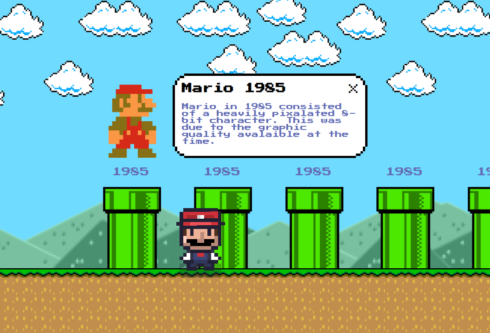

# Procesverslag
Markdown is een simpele manier om HTML te schrijven.  
Markdown cheat cheet: [Hulp bij het schrijven van Markdown](https://github.com/adam-p/markdown-here/wiki/Markdown-Cheatsheet).

Nb. De standaardstructuur en de spartaanse opmaak van de README.md zijn helemaal prima. Het gaat om de inhoud van je procesverslag. Besteedt de tijd voor pracht en praal aan je website.

Nb. Door *open* toe te voegen aan een *details* element kun je deze standaard open zetten. Fijn om dat steeds voor de relevante stuk(ken) te doen.

## Jij

### Ontwerper:
Claudio Bakker

#### Je startniveau:
Mijn startniveau is: Rood

# Je plan

  
De eerste versie/schets van je ontwerp & je persoonlijke uitdaging

  ### De eerste versie/schets:
  <!--  -->
  Mijn plan is om een tijdlijn te maken over Mario. De user kan naar links en rechts bewegen met de Mario character om zo langs de buizen te lopen. Vervolgens kan de user op de buizen klikken en komt er een Mario uit de buis die uit dat specifieke jaartal komt.
  
  

  ### Je ambitie: 
  Aan deze technieken/punten wil ik werken:
  - Animaties door middel van CSS
  - Positionering door middel van CSS
  - Interactie door middel van Javascript
 

## Voortgang/Feedback 1

  
Mijn bevindingen + wijzigingen (minimaal 5)

  
  ### Bevinding 1:
  Ik wist eerst niet zo goed over welk thema ik de opdracht ging maken dus ben ik eerst wat voor onderzoek gaan doen om inspiratie op te doen.

  #### oplossing:
  Ik ben inspiratie op gaan doen op internet om zo op ideeën te komen en heb vervolgens mijn ideeën op het mirobord geplaatst

  

  ### Bevinding 2:
  Ik ben begonnen met de basis van mijn concept uit te werken in codepen. Ik wilde eerst beginnen met het correct positioneren van de character en de buizen op de grond.

  

  #### oplossing:
  Ik ga al mijn code verder uitwerken in Visual Studio Code, en vervolgens flexbox en wellicht grid toepassen om zo alle elementen op de juiste manier te positioneren.

  ### Bevinding 3:
  Ik wilde graag mijn character laten bewegen doormiddel van de arrowkeys maar dit was mij nog niet gelukt.

  #### oplossing:
  Ik ga door middel van Javascript en CSS proberen de achtergrond te laten bewegen om zo de illusie te creeëren dat de gebruiker naar links of naar rechts kan lopen. Door een eventlistener op de arrow keys te zetten wil ik de achtergrond met transform translate Y een gegeven aantal pixels naar links of naar rechts laten bewegen terwijl de character in het midden van het scherm blijft staan.

  

  ### Bevinding 4:
  Ook wil ik een manier vinden om de character een loop animatie te geven zodat als de user heen en weer loopt de character ook lijkt te bewegen.

  #### oplossing:
  Ik ben gaan googlen naar hoe dit precies mogelijk zou kunnen zijn, en ik vond een aantal tutorials over hoe je met een sprite afbeelding je character een animatie kan geven. Een van de voorbeelden over hoe dit te werk zou kunnen gaan is: https://www.youtube.com/watch?v=ekI7vjkFrGA&t=1173s&ab_channel=DrewConley

  

  ### Bevinding 5:
  De buttons hebben nog geen andere states.

  #### oplossing:
  Ik ga meerdere states toevoegen aan de buttons zodat deze nog semantischer worden.

  

## Voortgang/Feedback 2

  
Mijn bevindingen + wijzigingen (minimaal 5)

  
  ### Bevinding 1:
  De user kan de info alleen wegklikken door op een (andere) buis te klikken, dit is misschien niet heel duidelijk.

  #### oplossing:
  Ik ga een close button toevoegen op de info modal zodat het voor de user handiger en duidelijker is dat deze modal weggeklikt kan worden.

  

  ### Bevinding 2:
  Ik heb nog niet echt een easter egg toegoevoegd dus op het moment voelt de tijdlijn nog een beetje statisch en leeg.

  #### oplossing:
  Ik ga planten toevoegen die uit de buizen komen, waar de user vervolgens op kan klikken om punten te verdienen. Als de user een X aantal punten heeft komt er geld uit de lucht vallen.

 

  ### Bevinding 3:
  Als de user de website opent kan hij of zij in het begin alleen naar rechts lopen, dit is niet helemaal duidelijk.

  #### oplossing:
  Ik ga een disabled state toevoegen aan de knop om naar links te lopen zodat deze pas beschikbaar wordt zodra de gebruiker eerst naar rechts heeft gelopen.

  

  ### Bevinding 4:
  Ik heb alle kleuren nu in de CSS staan, dit is niet heel handig en semantisch.

  #### oplossing:
  Ik ga alle kleuren in variabelen zetten binnen de :root in CSS.

  

  ### Bevinding 5:
  Tijdens het openen van de info modal blijven de planten uit de buizen komen, dit is niet heel handig.

  #### oplossing:
  Ik ga ervoor zorgen dat als de info modals omhoog zijn, de planten niet meer uit de buizen komen, maar zodra de modals weer naar beneden zijn dat de planten weer verder gaan met bewegen.

  

## Voortgang/Feedback 3

  
Mijn bevindingen + wijzigingen (minimaal 5)

  
  ### Bevinding 1:
  Ik heb nu heel veel gebruik gemaakt van classes en ID's, dit is semantisch niet correct.

  

  #### oplossing:
  Ik ga in de HTML en CSS alle overbodige classes en ID's weghalen en alles aanspreken door middel van selectors.

  

  ### Bevinding 2:
  Ik heb nog geen ALT texten bij de images toegevoegd, dit is semantisch niet goed.

  

  #### oplossing:
  Ik ga aan elke image een alt text toevoegen om zo de HTML nog semantischer en accesible te maken.

  

  ### Bevinding 3:
  Mijn CSS bestand is heel chaotisch en niet geordend.

  #### oplossing:
  Ik ga mijn CSS bestand opschonen en alles ordenen in categorieën.

  

  ### Bevinding 4:
  Ik heb geen geluidseffecten op mijn website.
  
  #### oplossing:
  Ik ga geluidseffecten toevoegen voor tijdens het lopen van de character en ook voor wanneer de user op een buis klikt.

  

  ### Bevinding 5:
  De website heeft nog geen darkmode.
  
  #### oplossing:
  Ik ga een darkmode toevoegen in de CSS zodat als de user een voorkeur heeft voor darkmode, dit ook mogelijk is. Dit zal redelijk makkelijk gaan aangezien ik alle kleuren al in variabelen heb gezet.

  

## Reflectie

  
Mijn eindresultaat & persoonlijke ontwikkeling

  ### Je uitkomst - karakteristiek screenshot(s):
  
  
  
  

  ### Dit ging goed/Heb ik geleerd: 
  Ik ben mij verder gaan verdiepen in HTML en CSS, ik begrijp nu beter hoe je in plaats van classes en ID's ook CSS selectors kan gebruiken. Verder heb ik door middel van Javascript de website heel interactief gemaakt, ik wilde graag dat de gebruiker heen en weer kon lopen net als in een echte mario game en dit is dan ook gelukt. Soms liep ik een beetje vast op de Javascript maar gelukkig ben ik er uiteindelijk toch uitgekomen en is alles naar mijn wens verlopen.

  

  ### Dit was lastig/Is niet gelukt:
  Ik vond de Javascript voor alle interactieve elementen nog redelijk lastig, maar gelukkig is het wel allemaal gelukt. Het liefst had ik de website nog beter in responsiveness gemaakt maar hier ben ik helaas niet volledig aan toegekomen.

  

## Bronnenlijst

continu bijhouden terwijl je werkt

Nb. Wees specifiek ('css-tricks' als bron is bijv. niet specifiek genoeg).

1. Character sprite: https://www.youtube.com/watch?v=ekI7vjkFrGA&t=1173s&ab_channel=DrewConley
2. Money rain: https://pixelcorners.lukeb.co.uk/?radius=8&multiplier=4&border=1&border_width=1&border_color=#000000
3. Plant image: https://www.pngkit.com/png/detail/354-3541979_carnivorous-plant-mario-piranha-plant-pixel.png
4. Coin image: https://gifer.com/en/gifs/coin
5. Mountains image: https://br.pinterest.com/pin/14003448825182088/
6. Pipe image: https://www.pngitem.com/middle/iTRTwTJ_mario-pipe-hd-png-download/
7. Mario 2023: https://character-stats-and-profiles.fandom.com/wiki/Mario_(Canon,_Illumination)/MemeLordGamer_Trap
8. Mario 2007: https://tiredoldhack.com/2016/09/04/writers-commentary-anatomy-of-a-mario-galaxy-review/
9. Mario 2006: https://upload.wikimedia.org/wikipedia/he/a/a9/MarioNSMBUDeluxe.png
10. Mario 2002: https://www.tag24.it/378487-super-mario-bros-film/
11. Mario 1996: https://www.kzone.com.au/gallery/gaming-legends-mario-1985-to-now-521511/page4
12. Mario 1991: https://nl.pinterest.com/pin/509047564138250896/
13. Mario 1990: https://pixelartmaker.com/art/364c3a25de35569
14. Mario 1998: https://pixelartmaker.com/art/a9e792fb75ef894
15. Mario 1985: https://pixabay.com/nl/vectors/mario-nintendo-retro-super-6005703/
16. Clouds: https://www.vhv.rs/viewpic/hxbxmhh_super-mario-bros-cloud-sprites-super-mario-clouds/
17. Walking sound: https://www.youtube.com/watch?v=gVhC9R6qeGs
18. Opening info modal sound: https://www.youtube.com/watch?v=FYFC5UdBZCY

